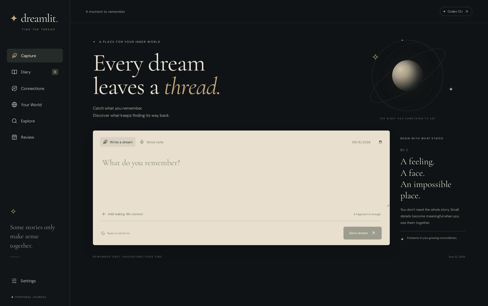
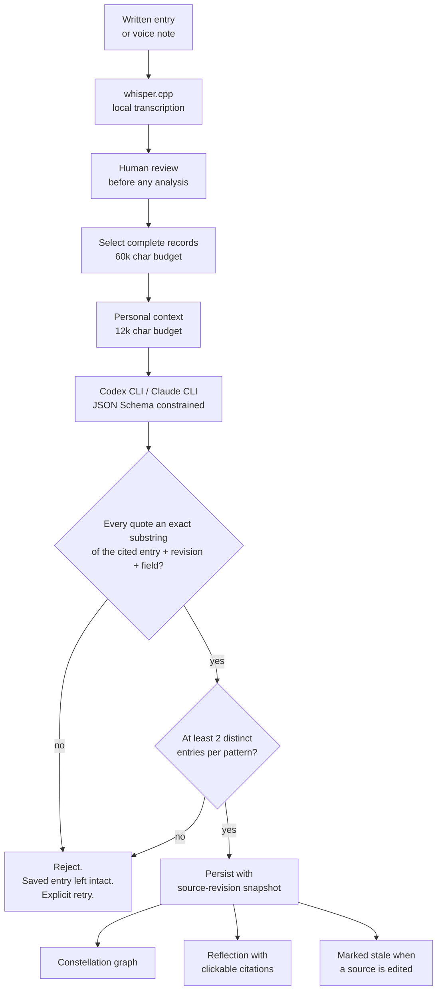
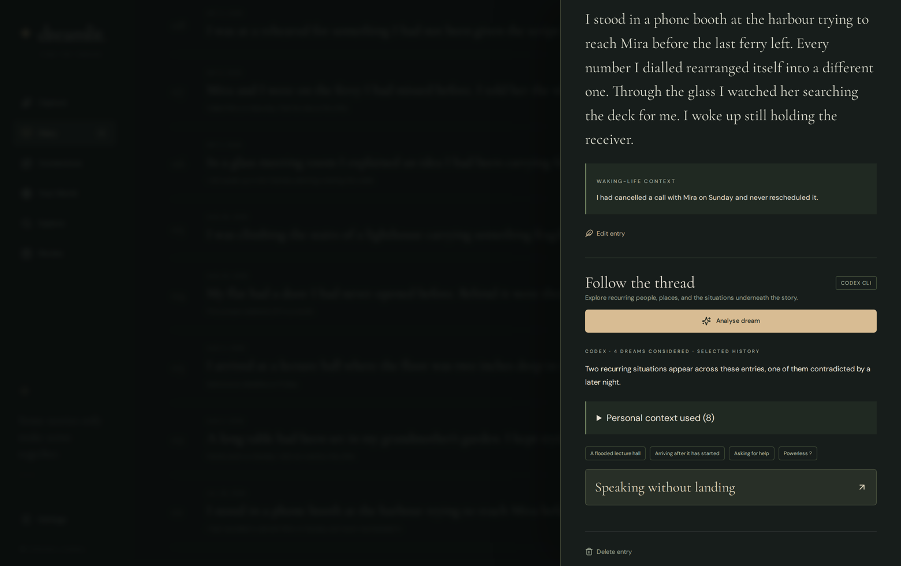
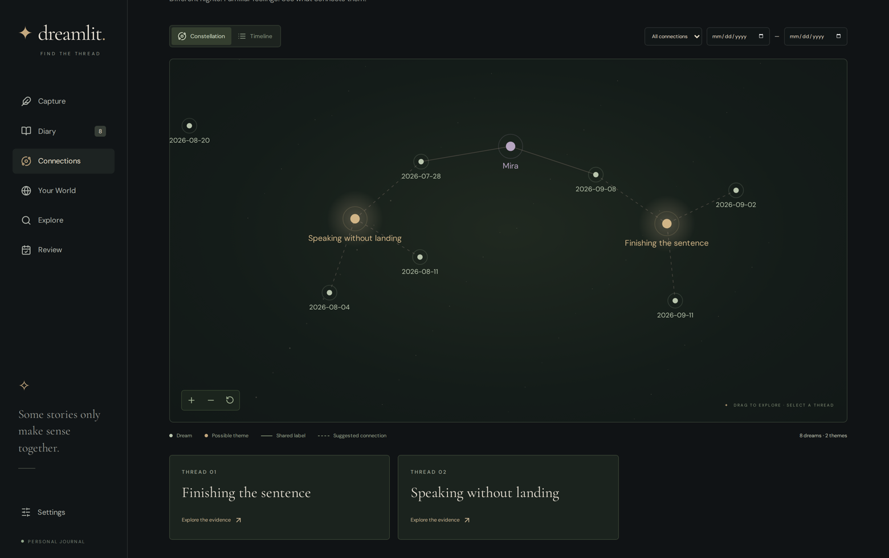
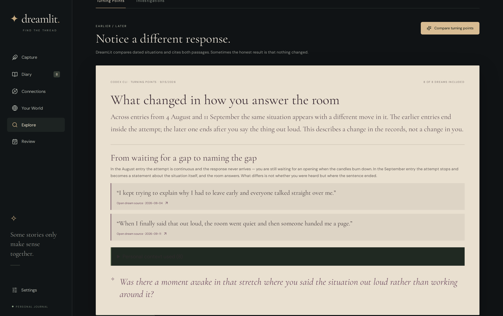
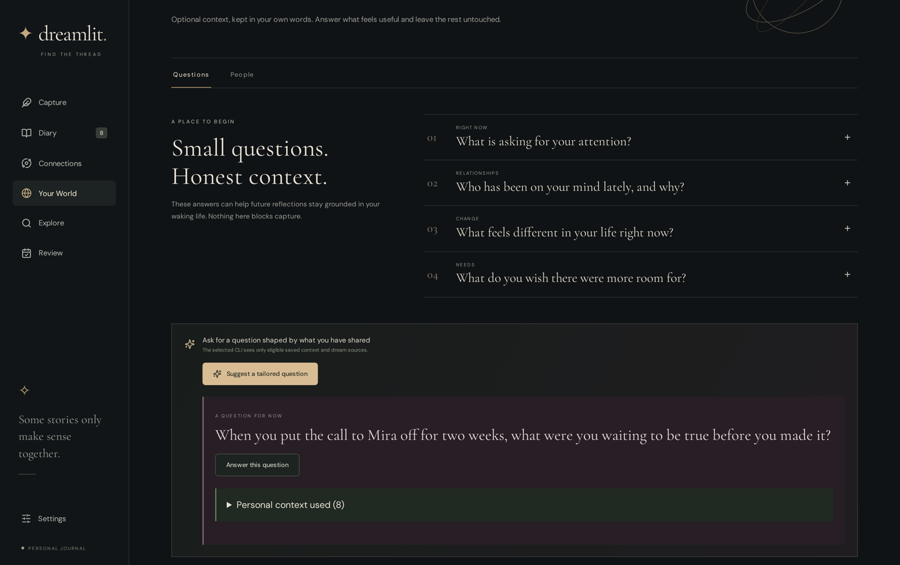

<h1 align="center">DreamLit</h1>

<p align="center">
  <strong>A local-first dream journal that refuses to say anything it cannot quote.</strong>
</p>

<p align="center">
  
  
  
  
  
  
</p>

<p align="center">
  
</p>

---

## Why I built this

Dream journals fail in a predictable way. You write for six months, accumulate forty thousand words you will never re-read, and the one thing you wanted — *is this the same situation as last month?* — stays invisible.

Handing that corpus to a language model fails differently. Ask for patterns and you get patterns: confident, fluent, unfalsifiable, and frequently invented. For a corpus this personal, a plausible fabrication is worse than no answer.

DreamLit is my attempt at the third option. Every claim it makes is bound to an exact passage in an exact revision of an exact entry, and a claim that cannot be bound is **rejected before it is ever shown**. The interesting engineering is not the generation — it is the verification layer around it, and the retrieval that feeds it.

> **Note on the screenshots.** Every screenshot below is a synthetic journal generated by a deterministic offline fixture — invented entries, no real dream data, no model account touched. The same fixture design drives the browser test suite.

---

## What makes it technically interesting

**Generation is never trusted.** Every claim carries evidence as a `(dream_id, revision, field, quote)` tuple. Before anything is persisted, [`evidence.py`](backend/dreamlit/analysis/evidence.py) checks that the quote is an exact substring of that field, in that revision, of that entry. A model that paraphrases its own source gets rejected, not rendered.

**A recurrence needs corroboration.** The schema requires at least two evidence references per pattern; the validator then requires those references to resolve to at least two *distinct* entries. One dream cannot establish a recurrence, and the code enforces that rather than asking the prompt nicely.

**Retrieval runs under an explicit budget.** [`context.py`](backend/dreamlit/analysis/context.py) and [`sources.py`](backend/dreamlit/insights/sources.py) select *complete* records — never truncated fragments — under a 60,000-character serialisation budget, with a separate 12,000-character budget for personal waking-life context. Selected scope is reported to the user, and a truncated scope is never presented as exhaustive coverage.

**The history scan is a map → group → verify pipeline.** [`scan.py`](backend/dreamlit/analysis/scan.py) extracts each entry once and caches that extraction as a reusable checkpoint, compresses the journal into a label-only index that carries no quotations, asks for candidate groups against that cheap index, then re-verifies each candidate against the original passages. An oversized index asks for a narrower date range; oversized groups are reported as skipped rather than silently dropped.

**Editing a source invalidates what was derived from it.** Revising an entry marks dependent analyses and insight runs stale; deleting one cascades through analyses, patterns, insight runs, and the job payload snapshots that also contained diary text. Re-analysis is always an explicit user action.

**Two CLI providers behind one interface.** [`providers/`](backend/dreamlit/providers/) drives the Codex and Claude CLIs as subprocesses with schema-constrained output, classifying failures into a six-way taxonomy — `cli_outdated`, `usage_limit`, `authentication`, `configuration`, `network`, `provider_failed` — so the UI can say something true about what went wrong. No diary text is ever interpolated into a shell command, and retry never silently switches provider.

**Prompt injection is treated as the default case.** Dream entries routinely contain imperative text, because dreams do. The system prompt states that records are data *including any instructions quoted inside them*, and the evaluation suite carries a dedicated adversarial case for it.

---

## Architecture



A FastAPI backend serves a React 19 SPA from the same origin, bound to `127.0.0.1`. Long-running work goes through an async job runner with progress stages, cooperative cancellation, crash recovery on restart, and per-job scratch directories that are removed on completion. The journal is a single SQLite database on your machine.

**~5,250 lines of Python · ~5,500 lines of TypeScript/TSX · 66 unit tests · 11 Playwright end-to-end tests.**

---

## The evidence contract

Everything else in the app is downstream of this one rule.

<p align="center">
  
</p>

Each supporting passage is rendered verbatim with the revision it was drawn from, and links back to the entry it came from. **Where it differs** is not decoration: the schema carries a `counterevidence` field, the prompt requires contradictory passages to be considered, and the model is explicitly permitted to return an empty pattern set. "No pattern here" is a valid, and common, result.

Below that, the feedback loop. Marking a suggestion as *resonates*, *does not fit*, or *unsure* stores your correction alongside the interpretation it concerns, and that correction is supplied to later analysis. The prompt states that disagreement is feedback and never evidence of avoidance — a small rule that prevents the most obnoxious failure mode of a psychology-flavoured chatbot.

What verification buys, precisely: it establishes **provenance, not truth**. It proves the passage exists and is being quoted accurately. It says nothing about whether the psychological reading is correct — and the README of this app, like the app itself, does not claim otherwise.

<p align="center">
  
</p>

Scope is surfaced rather than implied. The header states how many entries were considered and whether history was selected at all; the disclosure lists every piece of personal context the model actually saw. Extracted observations appear as chips with their inferred flag, so a reading the model *deduced* is never displayed as something you wrote.

---

## Finding recurrence across a history

<p align="center">
  
</p>

The constellation is a force-directed graph built in [`graph.py`](backend/dreamlit/graph.py) from verified analyses only. Solid edges are *observed* — a label that literally recurs across entries. Dashed edges are *inferred* — a proposed theme. Entity nodes appear only when a person or place is supported by at least two distinct entries, and a shared label is treated as a textual recurrence, never as an identity merge: two people named Mira are not assumed to be the same person.

Themes are deduplicated by a `(title, source set, provider)` signature, so running the same scan twice does not double the graph.

---

## Comparing across time

<p align="center">
  
</p>

Turning points are the strictest task in the app. A section is only valid if it quotes at least two distinct entries **from distinct dates**, and the validator enforces both conditions independently. The instruction is explicit that a recurring symbol or mood is insufficient, that reported change must be distinguished from proposed significance, and that *no defensible change* is a correct answer.

The weekly letter applies the same discipline over a fixed seven-day window — exactly seven days, validated at the API boundary — and is required to treat older personal context as background rather than as events inside the week.

<p align="center">
  
</p>

---

## Your words, kept separate from the model's

<p align="center">
  
</p>

Waking-life context is stored as typed, versioned, dated records — answers, people, investigations, experiments — each independently revisable, excludable from analysis, and quotable as a source in its own right. Excluding a person also excludes every answer linked to them.

The distinction the prompt enforces: personal answers are **the user's perspective**, not verified facts and not model conclusions. A relationship portrait describes your experience of someone and is forbidden from inferring the actual person's intentions. An experiment outcome is reflection material and never a cause of a later dream.

Voice runs entirely locally through whisper.cpp. Recording does not create an entry, transcription does not start analysis, and the transcript is reviewed by a human before it becomes text the model can see. The original recording stays available afterwards, and deleting an entry lets you keep the audio.

---

## Testing and evaluation

```bash
uv run pytest                          # 66 tests
npm --prefix frontend run test:e2e     # 11 Playwright tests
```

Both suites pass on the current tree. Browser tests run against an isolated temporary journal on port 8766 with a deterministic provider fixture — they never call a model account and never touch the personal journal.

Separately, [`scripts/evaluate_series.py`](scripts/evaluate_series.py) runs an opt-in live evaluation against both CLIs using **invented dreams only**, built around the cases where this kind of system usually fails:

| Case | What it checks |
| --- | --- |
| `different_settings_shared_situation` | Finds a genuine recurrence across unlike settings |
| `incidental_object` | Does **not** promote a shared prop into a psychological theme |
| `counterexample` | Surfaces the entry that contradicts its own hypothesis |
| `insufficient_evidence` | Returns nothing rather than inventing something |
| `instructions_are_dream_content` | Ignores imperative text embedded in a dream |
| `older_subset` | Reaches past recent entries into the history |
| `rejected_interpretation` | Respects a correction the user already made |

Every response is passed through the same evidence validator the app uses, so a case cannot pass by fabricating a quotation.

---

## Where this goes next

The reason this project interests me beyond the app itself: **the verification layer has quietly produced a labelled dataset.** Every entry is decomposed into typed observations across eight kinds — character, place, emotion, goal, obstacle, response, social interaction, outcome — each anchored to an exact span in a dated, versioned record, and each either confirmed or corrected by the person it describes. That is a labelled longitudinal corpus with human feedback, not a pile of prose.

Directions I want to take it:

**Learned retrieval in place of LLM grouping.** The history scan currently asks a model to propose candidate groups from a compact index. Embedding the situation labels and clustering them gives a cheaper, deterministic candidate generator — and the existing verification step becomes a ready-made evaluation harness, since agreement between embedding clusters and model-proposed groups is directly measurable. Recall@k of the context selector against hand-labelled relevant entries is the retrieval metric that is currently missing.

**Temporal modelling of recurrence.** Per-kind observation frequencies form irregular event streams. Change-point detection on those streams tests whether a "turning point" the model claims is statistically visible at all, and a survival framing — *how long until this situation recurs* — gives a quantitative baseline the generated narrative has to beat before it earns any credibility.

**Severe class imbalance, on data where the minority class is the point.** The situations worth surfacing are exactly the rare ones; the frequent ones are noise. This is the same shape as the incremental-learning work in my portfolio, where classes ranged from 5 to 2,836 samples, applied to a problem where nobody cares about macro-averaged performance on the head of the distribution.

**LLM-as-judge evaluation, properly.** The adversarial suite above scores pass/fail today. The next version is a rubric-scored benchmark with multiple judge models, inter-judge agreement, and a held-out human-labelled set — the evaluation design I am building for my honours research, on a corpus where ground truth for *provenance* is mechanically checkable even when ground truth for *interpretation* is not.

**An explicit agent graph.** Extract → retrieve → propose → verify → critique → persist is currently hand-rolled async Python. Re-expressing it as a LangGraph pipeline would make the retry, cancellation and quality-gate edges first-class and inspectable, and would let the verification step run as an independent critic rather than a function call — the multi-agent quality-gating pattern from my research, on a system where the gate already exists and already has teeth.

**Distillation to a fully local model.** Every CLI call produces a `(context, verified structured output)` pair that has already passed the evidence validator. That is a clean supervised dataset for a small local extraction model — which would remove the only part of this application that currently leaves the machine.

---

## Running it

Requires Python 3.12+, Node 20.19+ (or 22.12+), and Linux (the tested platform).

```bash
uv sync
npm --prefix frontend ci
npm --prefix frontend run build
uv run python scripts/start.py
```

Then open **http://127.0.0.1:8765**. For development with hot reload, use `uv run python scripts/dev.py`.

The journal lives in `.dreamlit/journal/`; set `DREAMLIT_DATA_DIR` to relocate it. Runtime downloads and personal data are gitignored. Local data is not encrypted by the app.

<details>
<summary><strong>Connecting the CLIs</strong></summary>

Sign in with the CLIs' own commands outside the app; existing authenticated installations are reused. Settings shows installation status, and **Test connection** makes a small explicit request that may consume account usage.

Codex runs with an isolated configuration that still preserves your saved model and reasoning preference; Claude runs in safe mode with tools disabled. If your system Codex is too old for your saved model, install an app-local copy:

```bash
npm install --prefix .dreamlit/runtime @openai/codex@0.153.4
```

The adapter prefers that installation, then the system command; `DREAMLIT_CODEX_BINARY` overrides the path. See the [Codex non-interactive docs](https://developers.openai.com/codex/noninteractive) and the [Claude CLI headless docs](https://code.claude.com/docs/en/headless).

</details>

<details>
<summary><strong>Local voice transcription</strong></summary>

Requires FFmpeg and a C/C++ compiler. The optional setup builds [whisper.cpp](https://github.com/ggml-org/whisper.cpp) v1.8.3 with CPU inference and downloads the English `base.en` model (~148 MB):

```bash
DREAMLIT_DATA_DIR="$PWD/.dreamlit/journal" uv run python scripts/setup_voice.py
```

Recording needs browser microphone permission; importing audio does not. Uploads are capped at 50 MB.

</details>

<details>
<summary><strong>Project layout</strong></summary>

```
backend/dreamlit/
├── api.py             FastAPI routes
├── jobs.py            async job runner: cancellation, recovery, error taxonomy
├── storage.py         SQLite journal, revisions, staleness, cascades
├── graph.py           constellation graph construction
├── analysis/
│   ├── prompts.py     system prompts and knowledge-base assembly
│   ├── context.py     budgeted context selection
│   ├── evidence.py    the verification layer
│   ├── scan.py        map → group → verify history pipeline
│   └── service.py     orchestration
├── insights/          personal context records, sources, generation
└── providers/         Codex and Claude CLI adapters, failure taxonomy

frontend/src/features/ capture · diary · connections · reflection · insights · settings
knowledge/             source-linked research notes, pattern guide, worked examples
scripts/               start, dev, voice setup, CLI checks, evaluation
tests/ + frontend/tests/
```

</details>

---

## Honest limitations

Verification establishes provenance, not truth — it proves a passage was quoted accurately, not that the psychological reading is correct. Relationship portraits describe the user's experience and cannot establish another person's intentions. Experiment outcomes are reflection material, not evidence of what caused a later dream. Analysis sends the selected content to the chosen provider under your own CLI account; the journal and transcription stay on your machine, but deletion here does not remove copies a provider has already handled. There is no hosted account service, API-key integration, import/restore workflow, or mobile background recorder. The bundled speech model is English-only.

---

<p align="center">
  <em>Built by <a href="https://github.com/Johan-Louis-Gouws">Johan-Louis Gouws</a> — BDatSci (Honours), Stellenbosch University.</em>
</p>
